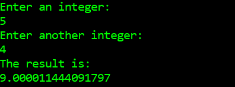

# adding-two-integers-with-overkill-neural-network
Training an overkill fully connected neural network to add two integers between 0-10 using PyTorch. Fun, yet stupid, little project 🤓

To test the model simply run test.py!

Have fun :)
